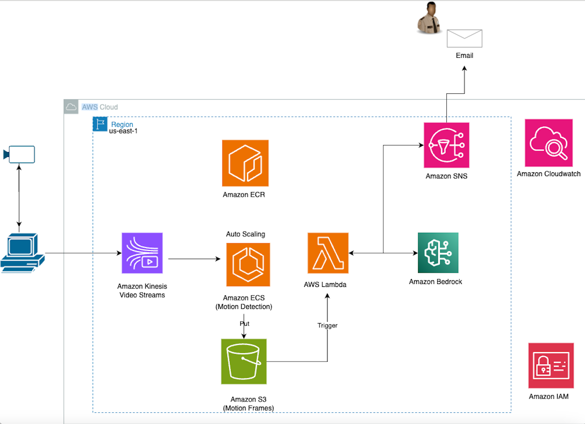

# Infrastructure Monitoring System with AI-Powered Threat Detection

This project implements a serverless infrastructure monitoring system with AI-powered threat detection using AWS services.

The infrastructure Monitoring System is designed to process video streams, detect motion, extract relevant snippets, and analyze them for potential security threats using AI. It leverages various AWS services to create a scalable and secure architecture for video processing and threat detection.

## Repository Structure

```
.
├── app.py
├── cdk.json
├── lambda
│   └── lambda_function.py
├── README.md
├── requirements-dev.txt
├── requirements.txt
├── source.bat
├── tests
│   ├── __init__.py
│   └── unit
│       ├── __init__.py
│       └── test_video_monitoring_stack.py
└── video_monitoring
    ├── __init__.py
    └── video_monitoring_stack.py
```

Key Files:
- `app.py`: The entry point for the CDK application.
- `cdk.json`: Configuration file for the CDK application.
- `lambda/lambda_function.py`: Contains the Lambda function code for video analysis.
- `video_monitoring/video_monitoring_stack.py`: Defines the infrastructure stack using AWS CDK.

## Usage Instructions

As this code is intended for demonstration purposes, we advise using non-sensitive video content for testing to ensure compliance with your organization's data protection policies.

### Installation

Prerequisites:
- Python 3.11 or later
- AWS CLI configured with appropriate credentials
- AWS CDK CLI installed

To set up the project:

1. Clone the repository
2. Create a virtual environment:
   ```
   python -m venv .venv
   ```
   OR
   ```
   python3 -m venv .venv
   ```
3. Activate the virtual environment:
   - On Windows: `.venv\Scripts\activate.bat`
   - On Unix or MacOS: `source .venv/bin/activate`
4. Install dependencies:
   ```
   pip install -r requirements.txt
   pip install -r requirements-dev.txt
   ```

### Deployment

#### CDK Deployment

Before deploying the Infrastructure Monitoring System, you need to bootstrap your AWS environment for CDK and synthesize the CloudFormation template:

1. Bootstrap the CDK environment (if not already done):
   ```
   cdk bootstrap 
   ```

2. Synthesize the CloudFormation template:
   ```
   cdk synth
   ```
   This command will generate a CloudFormation template based on your CDK code.

3. Deploy the Infrastructure Monitoring System:
   ```
   cdk deploy
   ```
   This will create all necessary AWS resources, including the VPC, S3 bucket, Lambda function, and SNS topic.

### Configuration

The main configuration for the stack is defined in `video_monitoring/video_monitoring_stack.py`. You can modify this file to adjust:

- VPC configuration
- S3 bucket settings
- Lambda function settings
- SNS topic configuration
- ECS task definition and service (planned addition)


### Troubleshooting

Common issues and solutions:

1. CDK synthesis fails
   - Ensure you have the latest version of AWS CDK installed
   - Check that your AWS credentials are correctly configured
   - Verify that all required dependencies are installed

2. Lambda function fails to process videos
   - Check the CloudWatch logs for the Lambda function
   - Ensure the S3 bucket permissions are correctly set
   - Verify that the Lambda function has the necessary IAM permissions

3. SNS notifications are not being sent
   - Check the SNS topic configuration in the stack
   - Verify that the Lambda function has permission to publish to the SNS topic
   - Ensure the email address is subscribed to the SNS topic

4. ECS tasks are not processing video streams (once implemented)
   - Check ECS task definitions and service configurations
   - Verify that ECS tasks have the necessary permissions to access KVS and S3
   - Review CloudWatch logs for ECS tasks to identify any runtime issues

For debugging:
- Enable verbose logging in the Lambda function and ECS tasks by setting the log level to DEBUG
- Use AWS X-Ray to trace requests through the application

## Data Flow

The Infrastucture Monitoring System processes data in the following sequence:

1. Video is streamed to Kinesis Video Streams (KVS)
2. ECS tasks continuously monitor the KVS stream for new video data
3. When motion is detected, the ECS task extracts a video snippet
4. The extracted snippet is uploaded to the S3 bucket
5. The S3 event triggers the Lambda function
6. The Lambda function retrieves the video snippet from S3
7. The function uses the Bedrock Runtime to analyze the video for potential threats
8. If a high-risk threat is detected, the function sends a notification via SNS
9. The analysis results are logged and can be viewed in CloudWatch



Note: The system uses VPC endpoints to securely access AWS services without traversing the public internet.

## Infrastructure

The Infrastucture Monitoring Stack creates the following AWS resources:

- VPC:
  * 2 Availability Zones
  * Public and Private subnets
  * NAT Gateway
  * VPC Endpoints for S3, KMS, ECR, Lambda, and SNS

- S3:
  * Bucket for storing video files
  * Server-side encryption with KMS
  * Lifecycle rule to expire objects after 7 days

- KMS:
  * Keys for S3 bucket, SNS, and ECR encryption

- ECR:
  * Repository for container images

- Kinesis Video Streams:
  * Stream for video data with 24-hour retention

- SNS:
  * Topic for sending threat alerts

- Lambda:
  * Function for video analysis and threat detection
  * VPC-enabled with custom security group

- IAM:
  * Roles and policies for Lambda execution

- ECS (Visit Workshop for deployment steps):
  * Cluster for running container tasks
  * Task definition for motion detection and video snippet extraction
  * Service to maintain desired number of tasks

The infrastructure is defined as code using AWS CDK, allowing for version control, easy updates, and reproducibility.

## Best Practices

The Infrastucture Monitoring System implements several best practices for security and code quality:

1. Encryption:
   - S3 bucket uses server-side encryption with KMS
   - SNS topic is encrypted using a dedicated KMS key
   - ECR repository uses KMS encryption for container images

2. Network Security:
   - VPC endpoints are used for secure access to AWS services without traversing the public internet
   - Lambda function is placed in a private subnet with a custom security group
   - Public and private subnets are properly configured for secure network architecture

3. Least Privilege Access:
   - IAM roles and policies are implemented following the principle of least privilege
   - Lambda function has specific permissions tailored to its needs

4. Key Management:
   - KMS is used for managing encryption keys for various services
   - Key rotation is enabled for enhanced security

5. S3 Best Practices:
   - Versioning is enabled on the S3 bucket
   - Lifecycle rules are implemented to expire objects after 7 days
   - Server access logging is enabled
   - Public access is blocked

6. Container Security:
   - ECR repository is configured for image scanning on push
   - Immutable image tags are enforced

7. Monitoring and Logging:
   - CloudWatch logs are used for Lambda function and ECS tasks
   - SNS notifications are sent for high-risk threats

8. Infrastructure as Code:
   - AWS CDK is used to define and manage infrastructure, ensuring consistency and reproducibility

9. Secure Configuration:
   - SSL/TLS is enforced for S3 bucket access
   - VPC is configured with proper subnetting and routing

10. Compliance:
    - Resources are configured to align with common compliance requirements (e.g., encryption, access controls)

These best practices ensure that the Infrastucture Monitoring System is built with security and reliability in mind, following AWS well-architected principles and industry standards for secure application development.

## Security

If you discover a potential security issue in this project, we ask that you notify AWS/Amazon Security via our [vulnerability reporting page](http://aws.amazon.com/security/vulnerability-reporting/). Please do **not** create a public GitHub issue.

For more information about our security practices, please refer to the [Best Practices](#best-practices) section above, which outlines the security measures implemented in this project, including encryption, network security, least privilege access, and other security-related configurations.

## License

This project is licensed under the MIT 0 - see the [LICENSE](LICENSE) file for details.

